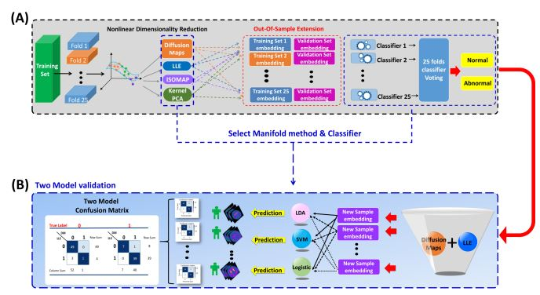
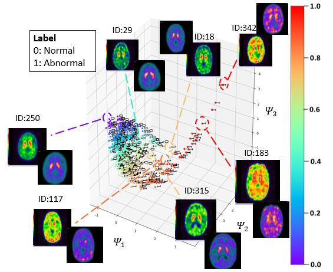

# Diffusion Maps SPECT

This repository contains the code of the following paper "**Dopamine Transporter SPECT Image Classification for Neurodegenerative Parkinsonism via Diffusion Maps and Machine Learning Classifiers (published in MIUA2021)**", https://arxiv.org/abs/2104.02066. Publish on https://link.springer.com/chapter/10.1007/978-3-030-80432-9_29





# Trajectory of 630 SPECT images embed in three-dimentional space



## Citation

Please cite the related works in your publications if it helps your research:
```
@inproceedings{Ding2021DopamineTS,
  title={Dopamine Transporter SPECT Image Classification for Neurodegenerative Parkinsonism via Diffusion Maps and Machine Learning Classifiers},
  author={Jun-En Ding and Chi-Hsiang Chu and Mong-Na Lo Huang and Chien-Ching Hsu},
  booktitle={MIUA},
  year={2021}
}

```

## Acknowledgement
https://github.com/dimkastan/PyTorch-Spectral-clustering
